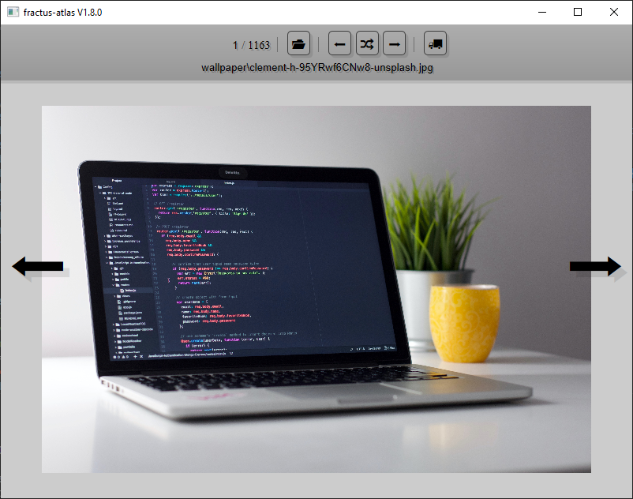

# Fractus Atlas

❔ This is an image viewer which allows you to quickly move them in folders.

💾 You can download this program on [releases tab](https://github.com/Jimskapt/fractus-atlas/releases).

🎥 You can see a video demonstration of this viewer (in top-left) on Youtube :

